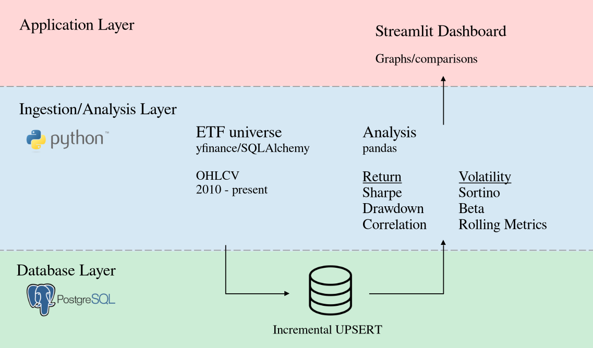
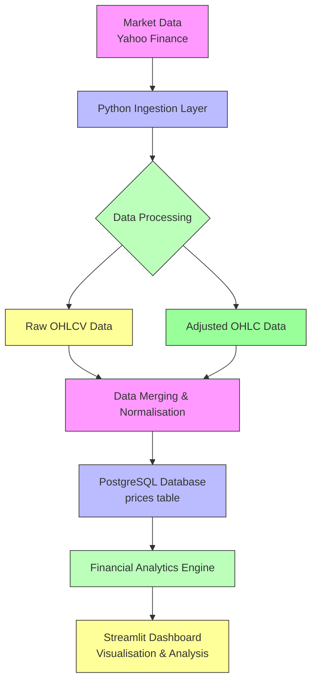

# ETF Performance Analytics Pipeline

A comprehensive financial data engineering pipeline that retrieves, processes, and analyses ETFs spanning 15+ years of market data. The system combines automated data ingestion, robust database management, quantitative financial analytics, and an interactive Streamlit dashboard for performance and risk analysis.



## Project Overview

This project implements an end-to-end ETL (Extract, Transform, Load) pipeline for exchange-traded funds (ETFs) that:

1. **Extracts** market data from Yahoo Finance for a curated universe of 100+ ETFs
2. **Transforms** and normalises the data, handling both raw and corporate-action-adjusted prices
3. **Loads** the data into PostgreSQL using upsert logic to maintain data integrity
4. **Analyses** the data to calculate performance, risk, and relational metrics
5. **Visualises** results through an interactive Streamlit dashboard

The pipeline is designed for incremental updates, efficiently downloading only new or changed data while maintaining a complete historical record.

## Architecture



## Key Features

### Data Pipeline
- **Automated market-data ingestion** via Yahoo Finance API
- **Incremental update strategy** minimises bandwidth and processing time
- **Dual data collection**: captures both raw market prices and corporate-action-adjusted prices
- **Robust data validation** with comprehensive quality checks
- **Duplicate prevention** using PostgreSQL UPSERT (INSERT ... ON CONFLICT DO UPDATE)
- **Overlap-based refresh** ensures recent data accuracy

### Financial Analytics
- **Return calculations**: simple returns, cumulative returns, annualised returns
- **Risk metrics**: volatility (historical and rolling), max drawdown, rolling drawdown
- **Risk-adjusted performance**: Sharpe ratio, Sortino ratio
- **Value-at-Risk**: parametric VaR and CVaR calculations
- **Market sensitivity**: beta, alpha, correlation analysis
- **Rolling window analysis**: time-varying volatility, Sharpe ratios, and drawdowns

### Database Design
- **Optimised schema** for financial time-series data
- **Primary key** on (date, ticker) for efficient lookups
- **Column structure** supporting both raw and adjusted OHLCV data:
  - Raw: open, high, low, close, volume
  - Adjusted: adj_open, adj_high, adj_low, adj_close
- **Indexes** implicitly created via primary key for fast ticker/date queries
- **Upsert logic** handles data revisions from Yahoo Finance gracefully

### Interactive Dashboard
- **Universe browser** filter ETFs by provider, geography, asset class, strategy, research role, and expense ratio
- **Manual ticker entry** for custom analysis
- **Preset views** for common investment themes (Global Equity, US Focus, Factors, Fixed Income, Commodities)
- **Five analytical tabs**:
  - Overview: ETF metadata and cumulative returns
  - Returns & Risk: distributions, VaR/CVaR, yearly volatility and drawdown
  - Rolling Analysis: time-varying metrics with configurable windows
  - Relationships: correlation matrices and regression analysis (beta/alpha)
  - Holdings: portfolio composition analysis (when holdings data available)

## Dataset

- **Universe sise**: 100+ ETFs spanning multiple asset classes, geographies, and strategies
- **Date range**: Configurable historical start (default: 2015-01-01) to present
- **Frequency**: Daily OHLCV (Open, High, Low, Close, Volume) data
- **Data fields**:
  - Raw market prices: open, high, low, close, volume
  - Adjusted prices: adj_open, adj_high, adj_low, adj_close (adjusted for splits, dividends, etc.)
- **Source**: Yahoo Finance via yfinance library
- **Update mechanism**: Incremental downloads with configurable overlap period (default: 7 days)

> **Note**: The repository does not include the actual market dataset. Data is downloaded dynamically from Yahoo Finance when running the pipeline. The ETF universe definition is embedded in the codebase.

## Data Pipeline

### Ingestion Process

1. **ETF Selection**: Reads ticker symbols from the defined research universe (100+ ETFs)
2. **Date Range Calculation**:
   - First run: downloads full history from configured start date
   - Subsequent runs: calculates incremental window based on latest stored dates
   - Applies overlap period (default 7 days) to catch data revisions
3. **Data Extraction**:
   - Downloads raw OHLCV data (`auto_adjust=False`)
   - Downloads adjusted OHLC data (`auto_adjust=True`)
   - Both downloads include volume data
4. **Data Transformation**:
   - Normalises yfinance multi-index DataFrames to flat format
   - Renames columns to match database schema
   - Merges raw and adjusted datasets on date and ticker
5. **Validation**: Performs OHLC relationship checks (high ≥ low, etc.)
6. **Storage**: Upserts records into PostgreSQL prices table

### Incremental Update Logic

The pipeline implements smart incremental updates:
- On first execution: downloads complete history for all ETFs
- On subsequent executions:
  - Identifies the earliest date currently stored across all ETFs
  - Sets download start to (earliest_stored_date - overlap_days)
  - Never goes before the configured historical start date
  - Download end is always yesterday (to avoid incomplete today's data)
- This approach ensures:
  - Efficient bandwidth usage (only download new/changed data)
  - Data integrity (overlap period catches revisions to recent data)
  - Complete historical coverage

## Financial Analytics

The analytics engine implements standard quantitative finance metrics:

| Metric | Description | Calculation Details |
|--------|-------------|-------------------|
| **Daily Return** | Simple daily percentage change | `(close_t - close_{t-1}) / close_{t-1}` |
| **Cumulative Return** | Total return over period | `∏(1 + daily_return) - 1` |
| **Annualised Return** | Geometric average annual return | `(1 + cumulative_return)^(252/trading_days) - 1` |
| **Volatility** | Annualised standard deviation of returns | `std(daily_return) × √252` |
| **Rolling Volatility** | Volatility over rolling window | `std(daily_return over window) × √252` |
| **Max Drawdown** | Largest peak-to-trough decline | `min((cum_return / running_max(cum_return)) - 1)` |
| **Rolling Drawdown** | Drawdown over rolling window | Max drawdown calculated within window |
| **Sharpe Ratio** | Risk-adjusted return (excess return/volatility) | `mean(daily_return) / std(daily_return) × √252` (assumes 0% risk-free rate) |
| **Sortino Ratio** | Downside-risk-adjusted return | `mean(daily_return) / std(negative_daily_return) × √252` |
| **Value-at-Risk (VaR)** | Threshold loss at confidence level | `percentile(daily_return, 1 - confidence_level)` |
| **Conditional VaR (CVaR)** | Expected loss beyond VaR | `mean(daily_return | daily_return ≤ VaR)` |
| **Beta** | Sensitivity to market movements | `covariance(asset_return, market_return) / variance(market_return)` |
| **Alpha** | Excess return vs. CAPM prediction | `asset_return - (risk_free_rate + beta × (market_return - risk_free_rate))` |
| **Correlation** | Linear relationship between assets | `covariance(X, Y) / (std(X) × std(Y))` |

> **Note**: Where applicable, rolling calculations use configurable windows (default: 30, 90, 252 days).

## Rolling Analysis

Rolling-window calculations enable time-series analysis of ETF characteristics:
- **Volatility regimes**: Identify periods of high/low market stress
- **Risk-adjusted performance trends**: Track changing Sharpe/Sortino ratios over time
- **Drawdown analysis**: Understand recovery patterns from market troughs
- **Correlation dynamics**: Observe how relationships between ETFs evolve
- **Beta stability**: Assess consistency of market sensitivity

The dashboard provides interactive controls to adjust rolling window sises and visualise these time-varying metrics.

## Streamlit Dashboard

The interactive dashboard provides comprehensive ETF analysis capabilities:

### Universe Navigation
- **Filter by provider**: Vanguard, iShares, State Street, etc.
- **Filter by geography**: United States, Europe, Emerging Markets, Japan, etc.
- **Filter by asset class**: Equity, Fixed Income, Commodity
- **Filter by strategy**: Broad Market, Large Cap, Factor, Sector, etc.
- **Filter by research role**: Core exposures, factor tilts, thematic allocations
- **Expense ratio (TER) slider**: Filter by cost efficiency

### Analysis Tabs

**Overview**
- Selected ETF metadata table (ticker, name, provider, geography, etc.)
- Cumulative return comparison chart
- Geographic and asset class distribution pie charts

**Returns & Risk**
- Return distribution analysis with histogram
- VaR and CVaR calculations at configurable confidence levels
- Skewness and kurtosis metrics
- Yearly volatility and max drawdown tables

**Rolling Analysis**
- Configurable rolling windows (30, 90, 252 days)
- Rolling volatility charts (annualised)
- Rolling Sharpe ratio charts
- Rolling drawdown charts (for windows ≥ 60 days)

**Relationships**
- Correlation matrix heatmap (full period)
- Rolling correlation charts between selected ETF pairs
- Beta and alpha calculation via linear regression
- Scatter plots with regression lines
- R-squared goodness-of-fit metrics

**Holdings** (when available)
- Holdings table visualisation
- Top 10 holdings by weight
- Sector weight breakdown
- Holding concentration metrics
- Time-series of unique holdings count

### Interactive Features
- Date range selector for analysis period
- Multi-select ETF choices with universe-browser validation
- Preset portfolio views for quick common analyses
- Downloadable chart images (Plotly integration)
- Responsive layout for different screen sizes

## Project Structure

```
etf-analytics-pipeline/
├── app/
│   └── streamlit_app.py          # Main Streamlit dashboard
├── data/                         # Data directory (gitignored)
├── docs/                         # Documentation
├── migrations/                   # Database migration scripts
├── notebooks/                    # Jupyter notebooks for exploration
├── scripts/                      # Utility scripts
│   ├── update_data.py            # Wrapper for data update (sets env vars)
│   ├── setup.py                  # Environment setup and initialisation
│   ├── reset_db.py               # Database reset and reinitialisation
│   ├── validate_data.py          # Comprehensive data validation
│   ├── export_data.py            # Export database to SQL statements
│   ├── db_status.py              # Show database statistics
│   ├── run_app.py                # Launch Streamlit dashboard
│   ├── run_tests.py              # Execute test suite
│   └── install_dev.py            # Install development dependencies
├── src/
│   └── finance_analytics/        # Main source code package
│       ├── __init__.py
│       ├── config.py             # Configuration management
│       ├── universe/
│       │   ├── __init__.py
│       │   └── etfs.py           # ETF universe definition (100+ ETFs)
│       ├── ingestion/
│       │   ├── __init__.py
│       │   ├── download.py       # Yahoo Finance data download
│       │   ├── normalization.py  # Data normalisation
│       │   └── merging.py        # Data merging and column renaming
│       ├── database/
│       │   ├── __init__.py
│       │   ├── connection.py     # Database connection management
│       │   ├── schema.py         # Schema creation and validation
│       │   └── operations.py     # DB operations (upsert, date calculations)
│       └── analytics/
│           ├── __init__.py
│           ├── returns.py        # Return calculations
│           ├── volatility.py     # Volatility metrics
│           ├── drawdown.py       # Drawdown calculations
│           ├── risk_metrics.py   # Risk-adjusted metrics (Sharpe, Sortino, VaR)
│           └── market_sensitivity.py # Beta, alpha, correlation
├── tests/
│   ├── __init__.py
│   ├── unit/                     # Unit tests
│   │   ├── __init__.py
│   │   └── test_analytics.py
│   └── integration/              # Integration tests
│       ├── __init__.py
│       │   └── test_database_integration.py
├── .env                          # Environment variables (gitignored)
├── .env.example                  # Example environment template
├── .gitignore
├── LICENSE
├── pyproject.toml
├── requirements.txt
└── README.md
```

## Installation

### Prerequisites
- Python 3.14+
- PostgreSQL database server
- Git (for version control)

### Setup Instructions

1. **Clone the repository**
   ```bash
   git clone https://github.com/yourusername/etf-analytics-pipeline.git
   cd etf-analytics-pipeline
   ```

2. **Configure environment**
   ```bash
   # Copy example environment file
   cp .env.example .env
   # Edit .env to configure your database connection:
   # DB_USER=your_username
   # DB_PASSWORD=your_password
   # DB_HOST=localhost
   # DB_PORT=5432
   # DB_NAME=finance_db
   # START_DATE=2015-01-01     # Optional: historical start date
   # OVERLAP_DAYS=7            # Optional: overlap for incremental updates
   # YFINANCE_PROGRESS=True    # Optional: show download progress
   # ETF_TICKERS=SPY,QQQ       # Optional: fallback ticker list
   ```

3. **Install dependencies**
   ```bash
   pip install -r requirements.txt
   ```

4. **Initialise database schema**
   ```bash
   python scripts/setup.py
   ```
   This script will:
   - Check Python version (≥3.14 required)
   - Verify PostgreSQL availability
   - Create .env file from example if needed
   - Install Python dependencies
   - Initialise database schema (create prices table)
   - Load initial ETF data (optional --skip-data flag)

5. **Run the data pipeline** (to populate database)
   ```bash
   # Since update_database.py is referenced but missing,
   # the update process can be run through the wrapper:
   python scripts/update_data.py
   
   # For first-time full download:
   python scripts/update_data.py --full
   
   # For incremental update (default behavior):
   python scripts/update_data.py
   
   # Custom date range (example: last 30 days):
   python scripts/update_data.py --days 30
   ```

6. **Launch the dashboard**
   ```bash
   python scripts/run_app.py
   # Or directly:
   streamlit run app/streamlit_app.py
   ```
   The dashboard will be available at http://localhost:8501

### Environment Variables

| Variable | Description | Default |
|----------|-------------|---------|
| `DB_USER` | PostgreSQL username | (required) |
| `DB_PASSWORD` | PostgreSQL password | (required) |
| `DB_HOST` | PostgreSQL host | `localhost` |
| `DB_PORT` | PostgreSQL port | `5432` |
| `DB_NAME` | Database name | (required) |
| `START_DATE` | Historical start date for full downloads | `2015-01-01` |
| `OVERLAP_DAYS` | Days to overlap for incremental updates | `7` |
| `YFINANCE_PROGRESS` | Show yfinance progress output | `True` |
| `ETF_TICKERS` | Fallback comma-separated ticker list | `SPY,QQQ` |

## Usage

### Running the Pipeline

#### Initial Data Load
```bash
# Complete setup and initial data load
python scripts/setup.py

# Or if database already exists:
python scripts/update_data.py  # Incremental update
```

#### Incremental Updates (Recommended for regular use)
```bash
# Standard incremental download (downloads new data + overlap period)
python scripts/update_data.py

# Quiet mode (suppresses yfinance progress output)
python scripts/update_data.py --quiet

# Specify custom overlap period (overrides .env setting)
# Note: This requires modifying the update script directly or setting env var
```

#### Full Historical Refresh
```bash
# Force complete re-download of all data
# WARNING: This will overwrite existing data with fresh downloads
python scripts/update_data.py --full

# Alternative: reset database completely then reload
python scripts/reset_db.py
python scripts/update_data.py
```

#### Date-Specific Downloads
```bash
# Download last N days only
python scripts/update_data.py --days 30

# Download from specific start date to yesterday
python scripts/update_data.py --start 2020-01-01

# Note: End date is always yesterday (to avoid incomplete intraday data)
```

### Data Validation
```bash
# Run comprehensive data quality checks
python scripts/validate_data.py

# Adjust outlier sensitivity (Z-score threshold)
python scripts/validate_data.py --threshold 3.0

# Include adjusted prices in validation
python scripts/validate_data.py --adjusted

# Automatically fix duplicate records
python scripts/validate_data.py --fix-duplicates
```

### Database Operations
```bash
# Check database status and statistics
python scripts/db_status.py

# Export database contents as SQL INSERT statements
python scripts/export_data.py > backup.sql

# Reset database to clean state (WARNING: deletes all data)
python scripts/reset_db.py
```

## Data Refresh / Incremental Updates

The pipeline implements an intelligent incremental update strategy:

### First Run
When no data exists in the database:
1. Downloads complete history for all ETFs from `START_DATE` to yesterday
2. Stores all OHLCV data (both raw and adjusted) in PostgreSQL
3. Creates primary key index on (date, ticker) for efficient querying

### Subsequent Runs
When data already exists:
1. **Identifies earliest stored date**: Finds the minimum date across all ETFs
2. **Calculates download start**: `earliest_stored_date - OVERLAP_DAYS`
   - Ensures we capture potential revisions to recent data
   - Never goes before `START_DATE` from configuration
3. **Sets download end**: Always yesterday (avoids incomplete today's data)
4. **Downloads only needed range**: Efficiently fetches incremental data
5. **Upserts into database**: 
   - **INSERT** new records (dates not previously stored)
   - **UPDATE** existing records (captures revisions from Yahoo Finance)
6. **Maintains data integrity**: OHLC relationship validation ensures quality

### Why Incremental Updates with Overlap?

Financial data providers like Yahoo Finance occasionally revise historical data due to:
- Corporate action adjustments (splits, dividends) being reclassified
- Data corrections from exchanges
- Changes in adjustment methodologies

The overlap period (default 7 days) ensures these revisions are captured by re-downloading recent data on each update cycle, while still maintaining efficiency by not re-downloading the entire history on every run.

## Results / Outputs

### Database Outputs
- **prices table**: Contains complete OHLCV data for all ETFs
  - 100+ ETFs × ~3,750 trading days (15 years) ≈ 385,000+ records
  - Columns: date, ticker, open, high, low, close, volume, adj_open, adj_high, adj_low, adj_close
  - Primary key: (date, ticker) ensures uniqueness

### Analytical Outputs (via Dashboard)
- **Return metrics**: daily, cumulative, annualised returns
- **Risk metrics**: volatility, max drawdown, rolling variants
- **Risk-adjusted performance**: Sharpe ratio, Sortino ratio
- **Tail risk**: Value-at-Risk (VaR), Conditional VaR (CVaR)
- **Market relationships**: beta, alpha, correlation analysis
- **Time-series analysis**: rolling windows for all metrics above
- **Holdings analysis**: portfolio composition (when holdings table available)

### Export Capabilities
- **SQL export**: `scripts/export_data.py` generates INSERT statements for backup/migration
- **Chart exports**: Dashboard charts can be downloaded as PNG via Plotly toolbar
- **Data validation reports**: Comprehensive quality assessment reports

## Limitations and Considerations

### Data Source Limitations
- **Yahoo Finance reliability**: Dependent on third-party API availability and data quality
- **Adjustment accuracy**: Corporate-action adjustments may not always be perfect
- **Delayed data**: Yahoo Finance data may not be real-time (typically end-of-day)
- **Ticker changes**: ETF ticker symbols may change over time (handled via universe definitions)

### Analytical Limitations
- **Simplified risk-free rate**: Sharpe/Sortino calculations assume 0% risk-free rate
- **Survivorship bias**: Universe definition may not include delisted/terminated ETFs
- **Currency conversion**: Returns calculated in trading currency; no FX adjustment for international ETFs
- **Tracking error**: Analysis does not quantify deviation from benchmark indices

### System Limitations
- **Single-user design**: Database not optimised for concurrent multi-user writes
- **Local deployment**: Designed for local development/demonstration; cloud deployment requires additional configuration
- **No scheduled automation**: Updates must be manually triggered (could be extended with cron/Airflow)
- **Limited error handling**: Production deployment would require enhanced error handling and logging

### Important Notes
- **Analytics vs. Trading**: This is an analytical/research system, not a trading execution system
- **No transaction costs**: Analysis excludes commissions, slippage, and market impact
- **No tax considerations**: Calculations are pre-tax
- **Benchmark assumptions**: Beta calculations use the first selected ETF as market proxy (configurable in code)
- **Data granularity**: Daily frequency only; no intraday or tick-level data

## Future Improvements

### Near-term Enhancements
1. **Create missing update_database.py**: Implement the core orchestration script
2. **Add unit test coverage**: Increase test coverage for ingestion and analytics modules
3. **Improve error handling**: Add retry logic and better error reporting
4. **Add data caching**: Cache Yahoo Finance responses to reduce API calls
5. **Enhanced validation**: Add more sophisticated anomaly detection

### Medium-term Features
1. **Scheduler integration**: Add support for automated updates (cron, Airflow, Prefect)
2. **Web deployment**: Dockerise for easy deployment to cloud platforms
3. **User authentication**: Add login/session management for multi-user scenarios
4. **Export formats**: Add CSV/Excel export capabilities from dashboard
5. **Benchmark library**: Expand benchmark options for beta/alpha calculations

### Long-term Vision
1. **Additional asset classes**: Extend beyond ETFs to stocks, mutual funds, crypto
2. **Factor modeling**: Implement comprehensive factor analysis (Fama-French, etc.)
3. **Portfolio optimisation**: Add mean-variance optimisation and efficient frontier
4. **Risk modeling**: Implement VaR forecasting, GARCH volatility models
5. **Machine learning**: Add predictive models for returns/risk classification
6. **Real-time capabilities**: Integrate real-time data streams for active trading

## Technologies

### Core Stack
- **Language**: Python 3.14+
- **Data Processing**: pandas, NumPy
- **Financial Data**: yfinance (Yahoo Finance API)
- **Database**: PostgreSQL with SQLAlchemy ORM
- **Analytics**: SciPy, statsmodels (for regression)
- **Visualisation**: Streamlit, Plotly (interactive charts)
- **Configuration**: python-dotenv (environment management)
- **Testing**: pytest (unit and integration testing)

### Key Dependencies
```
pandas>=2.0.0
numpy>=1.24.0
yfinance>=0.2.0
postgresql>=14.0
SQLAlchemy>=2.0.0
psycopg2-binary>=2.9.0
streamlit>=1.25.0
plotly>=5.0.0
statsmodels>=0.14.0
scipy>=1.10.0
python-dotenv>=1.0.0
```

### Development Tools
- **Code formatting**: ruff, black
- **Type checking**: mypy
- **Testing**: pytest, pytest-cov
- **Dependency management**: pip, requirements.txt
- **Environment**: virtualenv/venv

## Acknowledgements

This project was developed as a practical exercise in:
- Financial data engineering pipelines
- Quantitative analysis techniques
- Relational database design for time-series data
- Interactive data visualisation with Streamlit
- Modern Python packaging and dependency management

The ETF universe definition represents a diversified selection of exchange-traded funds across multiple providers, asset classes, geographies, and investment strategies suitable for analytical and research purposes.